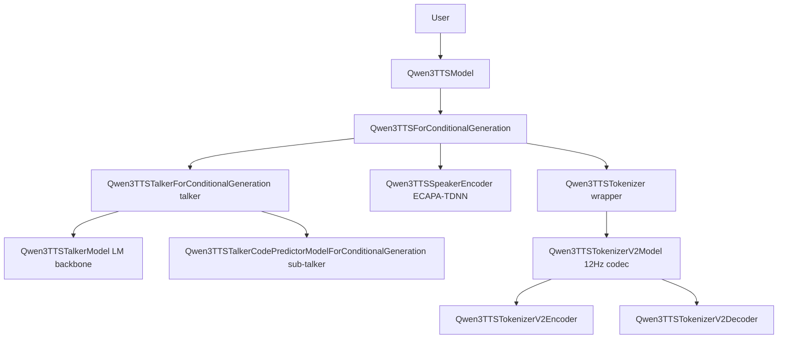

# Notes

## `jit2`

I think `jit2` is pretty easy to skim through so I not going to touch on it much, but I will explain how Qwen3-TTS (specifically Qwen3-TTS-0.6B-12Hz-Base) operates. So let's look into `jit2`. I want to touch on `export` in `jit2`, it is used in `compile.py` to get `NN`s directly. `compile.py` is pretty straight forward so just look into that. Ignore `orchestration` directory as it's useless for now as I haven't scripted any stateful management scripts.

```text
jit2
├── compile.py
├── export  # scripts that init `Qwen3TSSModel` class
│   ├── __init__.py
│   ├── load.py
│   ├── patches.py  # patches from prototype pipeline
│   ├── talkerlm.py
│   └── tokenizerv2.py
├── main.py  # entry point
├── orchestration  # orchestration, not scripted; ignore 4 now
│   ├── __init__.py
│   ├── models
│   │   ├── __init__.py
│   │   ├── talkerlm.py
│   │   └── tokenizerv2.py
│   └── pipeline.py
├── tests
│   ├── talkerlm
│   └── tokenizerv2
│       └── analyze_sdpa_diff.py
└── utils.py

9 directories, 21 files
```

## `qwen_tts`

Ok, now for `qwen_tts`. In `Jit2`, I use `Qwen3TTSModel` class as the entry point. Why? Cuz using the lower classes; `Qwen3TTSForConditionalGeneration` and `Qwen3TTSTokenizerV2Model` doesn't centralize a config. If we use `Qwen3TTSModel` class we can just use `Qwen/Qwen3-TTS-12Hz-0.6B-Base`, which is more simple in my opinion + no need to rewire anything. It also allows us to get `NN`s from Pytorch basically the same way so it doesn't really matter. You can also see that there are 2 management methods for `Qwen3TTSModel` for base variants; `generate_voice_clone()` and `create_voice_clone_prompt()`. Why I didn't use them? Because they have QoL features that would break execution graph. So that's why I will be manually rewriting them in `orchestration` in `Jit2` but for now it does nothing.

```text
qwen_tts/
├── cli
│   └── demo.py
├── core
│   ├── __init__.py
│   ├── models
│   │   ├── configuration_qwen3_tts.py
│   │   ├── __init__.py
│   │   ├── modeling_qwen3_tts.py
│   │   ├── processing_qwen3_tts.py
│   ├── tokenizer_12hz
│   │   ├── configuration_qwen3_tts_tokenizer_v2.py
│   │   ├── modeling_qwen3_tts_tokenizer_v2.py
│   └── tokenizer_25hz  # All Qwen3-TTS variants do not use this, ignore.
│       ├── configuration_qwen3_tts_tokenizer_v1.py
│       ├── modeling_qwen3_tts_tokenizer_v1.py
│       └── vq
│           ├── assets
│           │   └── mel_filters.npz
│           ├── core_vq.py
│           ├── speech_vq.py
│           └── whisper_encoder.py
├── inference
│   ├── qwen3_tts_model.py  # This is where `Qwen3TTSModel` class live.
│   └── qwen3_tts_tokenizer.py
├── __init__.py
├── __main__.py

16 directories, 33 files
```

Ok, let's explain the pipeline of Qwen3-TTS-0.6B-12Hz-Base. It's a Dual-track model, seperated into 2, TalkerLM and TokenizerV2.

# Inference Steps

Since `Qwen3-TTS-0.6B-12Hz-Base` is a voice-cloning ("base") model, the canonical inference path flows through `Qwen3TTSModel.generate_voice_clone()` (only Base variants can use this, I will follow this later on). I've broken down the architecture and the steps across the classes to make it easier to follow.

---

## Architecture Overview

I put together this diagram to show how I see the components interacting. `Qwen3TTSModel` acts as the primary orchestrator, delegating tasks to the conditional generation model and the tokenizer.

> **⚠️ AI Slop notice**, I parse my original architecture overview section into Gemini to bullet point it as the original is way too long. I think it's better this way. Don't worry though as I fat checked it.



In my view, the core logic is split between the `talker` (the LM backbone and its code-predicting sub-talker) and the `speaker_encoder` for embeddings. The `speech_tokenizer` just wraps the `Qwen3TTSTokenizerV2Model`, which handles the heavy lifting for the 12Hz codec through its own encoder and decoder modules.

---

## Step 1: Model Loading — `Qwen3TTSModel.from_pretrained()`

`Qwen3TTSModel.from_pretrained()` is the entry point. It:

1. Registers `Qwen3TTSConfig → Qwen3TTSForConditionalGeneration` with the HuggingFace `AutoModel`/`AutoConfig` registry.

2. Delegates to `Qwen3TTSForConditionalGeneration.from_pretrained()`, which:
   - Downloads `speech_tokenizer/*` files from the HF Hub.
   - Loads `Qwen3TTSTokenizer.from_pretrained()`, which registers and instantiates `Qwen3TTSTokenizerV2Model` for the 12Hz codec.
   - Attaches it to `model.speech_tokenizer`.
   - Loads `generation_config.json` and attaches it as `model.generate_config`.

3. `Qwen3TTSForConditionalGeneration.__init__()` builds the architecture:
   - `self.talker` — a `Qwen3TTSTalkerForConditionalGeneration` (the autoregressive LM that predicts codec codes).
   - `self.speaker_encoder` — a `Qwen3TTSSpeakerEncoder` (ECAPA-TDNN), instantiated **only for the "base" model type**.

4. The `Qwen3TTSTokenizerV2Model.__init__()` instantiates a `Qwen3TTSTokenizerV2Encoder` (based on MimiModel) and a `Qwen3TTSTokenizerV2Decoder`.

---

## Step 2: Building the Voice-Clone Prompt — `Qwen3TTSModel.create_voice_clone_prompt()`

Before generating speech, the reference audio must be processed:

### 2a. Encoding the Reference Audio (→ `Qwen3TTSTokenizerV2Model.encode()`)

`Qwen3TTSModel.create_voice_clone_prompt()` calls `model.speech_tokenizer.encode(ref_wavs, sr=...)`.

Inside `Qwen3TTSTokenizer.encode()`, the audio is normalized and passed through the `AutoFeatureExtractor`, then dispatched to `Qwen3TTSTokenizerV2Model.encode()`:

`Qwen3TTSTokenizerV2Model.encode()` calls `self.encoder.encode(input_values)` (the Mimi-based encoder) and returns a list of `audio_codes` tensors of shape `(T, num_quantizers)` — one entry per reference audio sample.

### 2b. Extracting the Speaker Embedding (→ `Qwen3TTSSpeakerEncoder`)

`create_voice_clone_prompt()` calls `model.extract_speaker_embedding(audio, sr)`. This computes a mel spectrogram of the reference audio (resampled to 24 kHz) and feeds it through the `Qwen3TTSSpeakerEncoder` (ECAPA-TDNN, which uses TDNN → SE-Res2Net → Attentive Statistics Pooling → Linear projection) to produce a speaker embedding vector.

The results are wrapped into `VoiceClonePromptItem` objects containing `ref_code`, `ref_spk_embedding`, `x_vector_only_mode`, and `icl_mode`.

---

## Step 3: Text Tokenization — `Qwen3TTSModel.generate_voice_clone()`

The target text is formatted with the chat template:

```
<|im_start|>assistant\n{text}<|im_end|>\n<|im_start|>assistant\n
```

It is then tokenized using the processor into `input_ids`, and the reference transcript is tokenized similarly into `ref_ids` for ICL mode.

Generation kwargs (e.g., `temperature`, `top_k`, `subtalker_top_k`) are merged from user args and `generation_config.json` defaults.

---

## Step 4: Core Codec-Token Generation — `Qwen3TTSForConditionalGeneration.generate()`

`Qwen3TTSModel` dispatches to `self.model.generate(input_ids, ref_ids, voice_clone_prompt, languages, ...)`.

Inside `Qwen3TTSForConditionalGeneration.generate()`:

### 4a. Speaker Embedding Injection

The `ref_spk_embedding` is extracted and prepared as `voice_clone_spk_embeds`. It will be injected into the codec prefix as the speaker conditioning vector.

### 4b. Building the Prefill Embedding

For each sample, a combined embedding sequence is constructed by interleaving:

- **Role prefix**: `<|im_start|>assistant\n` encoded via `talker.text_projection(talker.get_text_embeddings(...))`.
- **Codec prefix**: Language tag tokens (`codec_nothink_id` or `codec_think_id` + language ID), speaker embedding vector, and `codec_bos_id`, all looked up from `talker.get_input_embeddings()`.
- **Text embedding**: The target text tokens are projected via `talker.text_projection(talker.get_text_embeddings(...))`.

### 4c. ICL Prompt Construction (ICL mode for voice cloning)

When `icl_mode=True`, `generate_icl_prompt()` is called to build the in-context learning prefix. This concatenates the reference transcript text embedding and the reference audio code embeddings (from `ref_code`), forming the `icl_input_embed` that is appended before the target text.

### 4d. Batch Padding and Attention Mask

All sample embeddings are left-padded to the maximum length in the batch and an attention mask is generated.

### 4e. Talker Autoregressive Generation

`self.talker.generate(inputs_embeds, attention_mask, trailing_text_hidden, tts_pad_embed, ...)` is called on `Qwen3TTSTalkerForConditionalGeneration`.

Inside `Qwen3TTSTalkerForConditionalGeneration.forward()`:

- **Prefill phase**: The full input embedding is processed by the `Qwen3TTSTalkerModel` (a multi-layer causal LM with 3D RoPE). The `codec_head` linear layer predicts logits for the **first** codebook.
- **Generation phase** (each new step): The previous first-codebook token is embedded via `get_input_embeddings()`. The **sub-talker** (`code_predictor`, a `Qwen3TTSTalkerCodePredictorModelForConditionalGeneration`) then generates the remaining **15 codebook tokens** (codebooks 2–16) autoregressively. All 16 code embeddings are summed and injected back into the main talker for the next step. The `trailing_text_hidden` (remaining text token embeddings) is added at each step to guide the prosody.

### 4f. EOS Detection and Trimming

After generation, the full codec code matrix is extracted. The first codebook is scanned for EOS tokens to determine the effective sequence length per sample.

---

## Step 5: Waveform Decoding — `Qwen3TTSTokenizerV2Model.decode()`

Back in `Qwen3TTSModel.generate_voice_clone()`:

- For ICL mode, the reference `ref_code` is prepended to the generated codes (to provide waveform context for the decoder).

- `model.speech_tokenizer.decode([{"audio_codes": c} for c in codes_for_decode])` is called.

Inside `Qwen3TTSTokenizer.decode()`, the codes are padded and forwarded to `Qwen3TTSTokenizerV2Model.decode()`:

Inside `Qwen3TTSTokenizerV2Model.decode()`, audio lengths are computed and then `self.decoder.chunked_decode(audio_codes)` is called on `Qwen3TTSTokenizerV2Decoder`:

`Qwen3TTSTokenizerV2Decoder.forward()` executes the following pipeline on a chunk of codes:

1. **`SplitResidualVectorQuantizer.decode()`**: Converts discrete codes (shape `[B, K, T]`, K=16 codebooks) back to a continuous latent by summing the dequantized embeddings from the first semantic RVQ and the remaining acoustic RVQ.
2. **`pre_conv`**: A causal conv1d projects the latent to `latent_dim`.
3. **`pre_transformer`** (`Qwen3TTSTokenizerV2DecoderTransformerModel`): A sliding-window causal transformer with RoPE that refines the latent sequence (with `input_proj` and `output_proj` surrounding the attention layers).
4. **`upsample`**: Transposed causal convs + `Qwen3TTSTokenizerV2ConvNeXtBlock` blocks upsample the sequence.
5. **`decoder`**: A stack of causal convs and `Qwen3TTSTokenizerV2DecoderDecoderBlock` blocks (using `SnakeBeta` activations) upsample further and generate the raw waveform.

The chunked output waveforms are concatenated (with left-context trimming for overlap) and clipped to `[-1, 1]`.

---

## Step 6: Reference Audio Cropping

Because the reference codes were prepended before decoding (for waveform quality), the decoded waveform includes the reference audio segment at the start. `Qwen3TTSModel.generate_voice_clone()` computes the cut point proportionally and trims the leading reference portion, returning only the newly synthesized speech.

---

## End-to-End Summary

```Mermaid
graph TD
    Input[Input: text + ref_audio] --> GenVoiceClone[Qwen3TTSModel.generate_voice_clone]
    GenVoiceClone --> CreatePrompt[create_voice_clone_prompt]
    CreatePrompt --> TokenizerEncode[Qwen3TTSTokenizerV2Model.encode: ref_audio to ref_code T x 16]
    CreatePrompt --> SpeakerEncoder[Qwen3TTSSpeakerEncoder.forward: ref_audio to spk_embedding]
    GenVoiceClone --> ConditionalGen[Qwen3TTSForConditionalGeneration.generate]
    ConditionalGen --> BuildPrefill[Build prefill embedding text + speaker + language + ICL ref_code]
    BuildPrefill --> TalkerGenerate[Qwen3TTSTalkerForConditionalGeneration.generate]
    TalkerGenerate --> StepCode0[Each step: codec_head to codebook 0 token]
    StepCode0 --> SubTalker[Sub-talker code_predictor to codebook 1-15 tokens]
    SubTalker --> CodesList[talker_codes_list T x 16]
    CodesList --> PrependRef[Prepend ref_code to decode]
    PrependRef --> TokenizerDecode[Qwen3TTSTokenizerV2Model.decode: codes to waveform]
    TokenizerDecode --> TrimRef[Trim reference prefix]
    TrimRef --> FinalOutput[Output: List of np.ndarray audio + sample_rate]
```